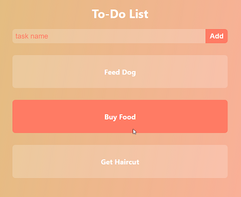

# ToDoReactApp
To-do list react app that displays my new skills for making functional, styled and well laid out React components.
## What I Learned:
- Structuring stateless functional React components
- React Hooks
- Styling with CSS Modules
- JSON Array Mapping
## GitHub Pages:
### Link:
https://jarodburchill.github.io/ToDoReactApp
### Preview:

## Installation: 
```
git clone https://github.com/jarodburchill/ToDoReactApp
cd ToDoReactApp
npm install
npm start
```
